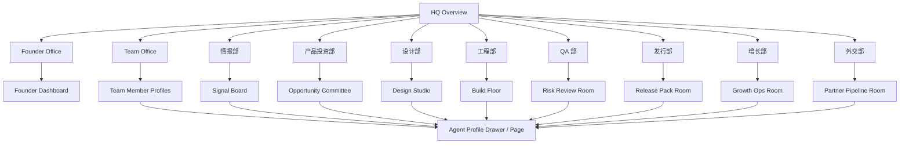

# OPC Frontend Architecture

## 部门架构图 + 页面信息架构 + 前端模块清单

本文件用于把 OPC 的前端设计进一步收敛成可实现的结构，重点回答：

1. 总部大楼里有哪些办公室
2. 每个办公室里应该展示什么
3. 页面层级如何组织
4. 哪些模块是全局共享模块
5. V1 应该先做哪些、后做哪些

## 产品目标

OPC 前端不是普通 dashboard，而是一家可视化运转中的 AI 公司。

用户看到的应该不是：

- 一堆卡片
- 一堆聊天记录
- 一堆后端任务日志

而应该是：

- 一栋总部大楼
- 各部门办公室实时运转
- 人与人、Agent 与 Agent 之间有协作关系
- Founder 能看到公司整体经营状态
- 每个 Agent 都像一个真的员工

## 总体页面层级

建议采用三层结构：

1. `HQ Overview`
2. `Office Detail`
3. `Agent Profile（Drawer / Page）`

外加两个跨层级系统：

- `A2A Collaboration Overlay`
- `Artifact / Project Drawer`
- `Observability Dock`

## 比赛版外部借力分层

当前如果按比赛速胜版推进，前端分层应明确为：

- `视觉舞台层`
  - 借 `Star-Office-UI` 的楼层、办公室和角色氛围
- `经营驾驶舱层`
  - 借 `mission-control` 的 Founder 指标与 cockpit 组织方式
- `A2A 语义层`
  - 借 `ClawTeam` 的 leader + swarm + 实时协作逻辑
- `角色与能力层`
  - 借 `agency-agents + gstack + MiniMax skills` 的 persona、workflow、skills、tools 模板
- `信号来源层`
  - 借 `Agent-Reach` 的多源读取思路，`MediaCrawler` 只做赛前离线准备
- `OPC 自研层`
  - 必须自己做：HQ 主叙事、Team Office、Founder 决策逻辑、Agent Profile、Artifact、Observability

所有外部项目都只能作为加速器，不直接成为 OPC 的真源结构。

## 页面信息架构

## 楼层与办公室配置

建议整栋楼分成 5 层：

| 楼层 | 办公室 | 角色定位 | 说明 |
| --- | --- | --- | --- |
| L5 | Founder Office | 总部决策层 | 最高 leader、经营面板、优先级拍板 |
| L4 | Team Office / 外交部 | 上下文与外部关系层 | 团队背景输入、合作方和 candidate 管理 |
| L3 | 情报部 / 产品投资部 | 机会发现与立项层 | 找机会、判断值不值得做 |
| L2 | 设计部 / 工程部 | 产品生产层 | 把机会做成真实产品 |
| L1 | QA 部 / 发行部 / 增长部 | 发布与增长层 | 检查、包装、上架、传播 |

## HQ Overview 页面

### 页面定位

HQ Overview 是全局首页，也是 Demo 主舞台。

### 页面目标

- 一眼让评委理解“这是一家公司”
- 一眼看到有哪些部门、谁在工作、哪几个任务在流转
- 一眼看到当前正在孵化的旗舰项目

### 核心模块

- `BuildingScene`
  - 总部大楼像素全景
  - 各楼层办公室状态
  - 人物 idle / working / reviewing 动画
- `GlobalCompanyPulse`
  - 今日机会数
  - 本周立项数
  - 在制 App Cells
  - Release Pack 完成率
  - Partner Pipeline 数量
- `Project Spotlight`
  - 当前旗舰项目
  - 主阶段
  - 并行阶段摘要
  - spotlight owner / 办公室
  - 下一步动作
- `A2AOverlayToggle`
  - 打开 / 关闭跨办公室任务飞线
- `LiveEventTicker`
  - 最新事件流
  - 例如：情报部提交新信号、Founder 批准立项、发行部生成首版 screenshot brief

## Founder Office

### 页面定位

总部决策层与经营驾驶舱。

### 页面目标

- 展示公司经营全貌
- 展示 Founder 的决策动作，而不是只展示大屏
- 汇总 Team Office、外交部、各业务部门输入

### 核心模块

- `FounderHeroPanel`
  - Founder Agent 头像
  - title
  - 当前判断
  - 今日重点
- `CompanyMetricsBoard`
  - 机会数
  - 在制项目数
  - ship streak
  - 预估 ROI
  - partner status
  - 团队负载
- `DecisionQueue`
  - 待拍板机会
  - 风险升级事项
  - partner 跟进事项
- `PriorityShiftPanel`
  - 当前全公司优先级
  - 被暂停的项目
  - 新批准的项目
- `FounderMemoFeed`
  - Founder 的最新 memo
  - 可同步回各办公室
- `RuntimeDigestPanel`
  - 关键模块业务层 JSON 摘要
  - 系统异常、降级与重试摘要

### 必须展示的信息来源

- Team Office 摘要
- 情报部机会榜
- 产品投资部立项建议
- 外交部 candidate / partner 线索
- 发行部 release 状态

## Team Office

### 页面定位

你们团队的“上下文注入层”和“人才资产层”。

### 页面目标

- 展示四位成员的真实背景
- 让系统后续能读取这些信息做机会筛选和任务分配
- 为未来其他用户开放“团队配置”埋下结构

### 核心模块

- `TeamGrid`
  - 四位成员卡片
  - 状态
  - 当前负责模块
- `TeamMemberCard`
  - 姓名
  - title
  - skills
  - social proof
  - GitHub / 社媒
- `ContextConfigPanel`
  - 偏好赛道
  - 擅长方向
  - 目标类型
  - 常用模型 / 工具
- `TeamStrengthRadar`
  - 产品
  - 算法
  - iOS
  - 工程平台
  - 内容传播
  - 商业化
- `InternalOwnershipBoard`
  - 每个办公室当前由谁主导
  - 每位成员当前占用情况

### 与系统的关系

- 这里的数据要同步到 Founder Office
- 这里的数据要参与 Opportunity Committee 的优先级判断

## 情报部

### 页面定位

前沿信息挖掘中心。

### 页面目标

- 展示信号来源和结构化摘要
- 证明旗舰项目不是拍脑袋立项

### 核心模块

- `SignalSourceBar`
  - GitHub
  - X
  - 小红书
  - arXiv
  - Bilibili / Web
- `SignalBoard`
  - 每条信号的原始片段
  - 热度
  - 痛点
  - 时效性
- `TrendClusterView`
  - 把分散信号聚成几个主题簇
- `OpportunityCandidateList`
  - 候选方向
  - fit score
  - buildability
  -传播性
- `IntelligenceAgentStatus`
  - scout agent
  - synthesizer agent
  - 当前任务和进度

## 产品投资部

### 页面定位

模拟一场“投资委员会 / 立项会”。

### 页面目标

- 把“信号”变成“值得做的项目”
- 展示为什么做、为什么现在做、为什么我们能做

### 核心模块

- `CommitteeTable`
  - 候选项目
  - 讨论状态
  - 当前推荐结论
- `OpportunityScoreCard`
  - ROI
  - 传播性
  - iOS fit
  - 团队 fit
  - 上架可行性
- `OpportunityBriefPanel`
  - 用户画像
  - 核心功能
  - 差异化
  - 变现方式
- `ApprovalTimeline`
  - 提交
  - 评审
  - Founder 批准
- `DecisionLog`
  - 记录每一次选择背后的原因

## 设计部

### 页面定位

产品定义与视觉方向产出层。

### 页面目标

- 展示这个 App 正在从想法变成可以看的产品
- 强调你们不是模板化生成

### 核心模块

- `DesignMoodboard`
  - 配色
  - 字体
  - 气质关键词
- `InformationArchitecturePanel`
  - 页面结构
  - 用户流程
- `CoreScreenGallery`
  - 首页
  - 核心功能页
  - 结果页
- `DesignAgentTasks`
  - 当前任务
  - 进度
  - review 状态
- `DesignReviewNotes`
  - Founder / PM / 工程反馈摘要

## 工程部

### 页面定位

App Cell 的主生产车间。

### 页面目标

- 展示真正的代码和构建状态
- 证明不是 PPT 原型，而是真的在生成产品

### 核心模块

- `BuildFloorOverview`
  - 当前 App Cell
  - 主构建阶段
  - 并行任务数
  - spotlight owner / 协作 owners
- `CodeArtifactPanel`
  - 项目结构
  - 关键文件
  - 代码 diff 摘要
- `BuildTaskBoard`
  - 页面开发
  - 状态管理
  - API 接入
  - 本地数据
- `PreviewDeviceFrame`
  - iPhone 预览
  - 页面切换
- `EngineerAgentStatus`
  - Bald Engineer
  - App Builder
  - 当前协作关系
- `BusinessJsonPanel`
  - 当前模块输入、关键中间结果、输出
- `SystemLogStream`
  - 启动、关键调用、耗时、异常、重试、降级、最终状态

## QA 部

### 页面定位

质量闸门和风险升级中心。

### 页面目标

- 让项目看起来真实可信
- 在 Demo 中展示“这家公司会自查，不是无脑生成”

### 核心模块

- `RiskRadar`
  - 功能风险
  - 视觉风险
  - 上架风险
- `ReviewChecklist`
  - 必测项
  - 待修项
  - 已通过项
- `IssueBoard`
  - bug
  - blocker
  - owner
  - SLA
- `EscalationFeed`
  - 升级到 Founder 的事项
- `QASummaryCard`
  - 当前质量结论
  - 能否进入发行阶段
- `BusinessJsonPanel`
  - 风险扫描与验收输入输出
- `SystemLogStream`
  - QA 检查、升级、阻塞与回归记录

## 发行部

### 页面定位

App Store 上架材料生产室。

### 页面目标

- 把“产品已做完”变成“可以上架”
- 展示你们对 Apple 生态的理解

### 核心模块

- `ReleasePackOverview`
  - 当前 release 完成率
  - 当前缺口
- `MetadataEditor`
  - App 名
  - subtitle
  - keywords
  - description
- `ScreenshotStoryboard`
  - 各张截图的卖点说明
- `IconDirectionPanel`
  - 图标方向
  - 风格说明
- `AppReviewChecklist`
  - 权限
  - 隐私
  - 文案风险
  - 重复应用风险
- `BusinessJsonPanel`
  - release pack 生成输入、元数据输出、审核风险结构
- `SystemLogStream`
  - 生成耗时、失败重试、缺失项和最终状态

## 增长部

### 页面定位

对外传播与增长假设中心。

### 页面目标

- 告诉评委“做出来之后怎么传播”
- 把社媒势能和产品包装结合起来

### 核心模块

- `NarrativeBoard`
  - 项目的外部故事
  - 打法
  - 标签
- `GrowthExperimentList`
  - 小红书内容方向
  - B 站选题
  - X 传播方向
- `SocialProofPanel`
  - 团队已有影响力
  - 预期传播渠道
- `LaunchPlanCard`
  - 上线首周动作
  - 关键目标
- `GrowthAgentTasks`
  - 文案
  - 素材
  - 发布节奏

## 外交部

### 页面定位

商业化、渠道和合作关系中枢。

### 页面目标

- 展示 scalable potential
- 让 founder 能看到 partner/candidate 机会

### 核心模块

- `PartnerPipelineBoard`
  - candidate
  - contacted
  - active
  - strategic
- `PartnerCard`
  - 名称
  - 类型
  - 价值
  - 状态
  - next action
- `ChannelMap`
  - 发行渠道
  - 合作媒介
  - 潜在受众入口
- `BusinessSignalSync`
  - 同步到 Founder Office 的重点线索
- `BDTaskFeed`
  - 谁跟进
  - 截止时间
  - 当前状态

## Agent Profile 页面

### 页面定位

每个 Agent 的超详细员工主页。

### 页面结构

- `ProfileHeader`
  - 名字
  - title
  - 头像
  - 办公室
  - 状态
- `MissionPanel`
  - 当前任务
  - 当前项目
  - 进度
  - ETA
- `SkillTree`
  - 能力徽章
  - skill level
- `ToolPluginPanel`
  - models
  - data sources
  - plugins
  - permissions
- `CollaboratorMap`
  - 上游
  - 下游
  - 最近交接内容
- `RecentOutputs`
  - brief
  - code
  - design
  - memo
- `BackstoryPanel`
  - 性格
  - 风格
  - 负责边界

## 全局共享模块

这些模块不属于单个办公室，而是全系统复用：

- `A2ACollaborationOverlay`
  - 办公室间连线
  - 任务包飞线
  - 颜色区分不同产物
- `ObservabilityDock`
  - 打开当前页面的业务层 JSON 与系统级 log
- `TaskProgressEngine`
  - mock 数据驱动
  - 状态机：idle / working / waiting / reviewing / escalated / completed
- `ArtifactDrawer`
  - 打开 PRD
  - design brief
  - code summary
  - QA report
  - release pack
- `ProjectContextBar`
  - 当前旗舰项目
  - 主阶段
  - 并行阶段摘要
  - spotlight owner / 办公室
- `LiveNotificationFeed`
  - 全局事件提示
- `FilterAndFocusMode`
  - 只看某个项目
  - 只看某个部门
  - 只看某条协作链路

## V1 关键数据结构

建议前端统一这几类结构：

- `Office`
- `AgentProfile`
- `AgentTask`
- `Project`
- `Artifact`
- `Skill`
- `ToolPlugin`
- `CollaborationEdge`
- `DecisionMemo`
- `Signal`
- `TrendCluster`
- `OpportunityCandidate`
- `OpportunityScore`
- `OpportunityBrief`
- `PartnerCandidate`
- `TeamMemberContext`
- `WorkspaceContext`
- `CompanyMetric`
- `BusinessJsonSnapshot`
- `SystemLogEntry`

除了上述业务结构，比赛版还需要一层外部复用适配概念：

- `visual adapter`
- `skill catalog adapter`
- `signal source adapter`
- `workflow semantics adapter`
- `profile adapter`

## V1 实现优先级

### P0 必做

- HQ Overview
- Founder Office
- Team Office
- 情报部
- 产品投资部
- 工程部
- 发行部
- Agent Profile
- A2A Collaboration Overlay
- 外部复用后的风格统一与主叙事收敛

### P1 应做

- 设计部
- QA 部
- 增长部
- 外交部
- Artifact Drawer
- Live Event Ticker

### P2 可延后

- 深度配置能力
- 多项目并行切换
- 历史 replay
- 细粒度权限系统

## 前端开发拆分建议

| 模块 | 建议负责人倾向 | 说明 |
| --- | --- | --- |
| HQ Overview / BuildingScene | 石千山 + Randy | 一个偏前端系统，一个偏视觉呈现 |
| Founder Office | 彭智炜 + 石千山 | 一个定经营叙事，一个搭 dashboard |
| Team Office | 彭智炜 | 最适合统一团队对外画像 |
| 情报部 / 产品投资部 | 张涛 + 彭智炜 | 一个负责结构化判断，一个负责产品化叙事 |
| 设计部 / 发行部 | Randy | 最贴近其长板 |
| 工程部 / A2A Overlay | 石千山 + 张涛 | 一个偏平台和前端，一个偏 agent 结构 |

## 页面验收标准

- HQ 首页打开后，用户 10 秒内能认出这是一家公司，而不是普通 dashboard
- 所有办公室都可以点击进入
- 每个办公室至少有一个清晰的主模块，不是空房间
- 任意 Agent 都能打开完整的 profile 页面
- Founder Office 能看到 Team Office、外交部、业务部门的摘要
- A2A 连线打开后，用户能理解任务从哪个部门流向哪个部门
- 旗舰项目在至少 5 个办公室中有连续状态体现
- 发行部能看到完整的上架素材结构，而不是一句“ready to ship”

## 最终实现原则

- 先做“能讲清楚公司如何运转”的骨架，再做细节炫技
- 先保证 Founder、Team、情报、投资、工程、发行这些关键房间成立，再扩其他房间
- 先保证跨部门链路成立，再追求每个房间都特别满
- 先保证角色鲜明和叙事统一，再补更细粒度的配置与插件调用
